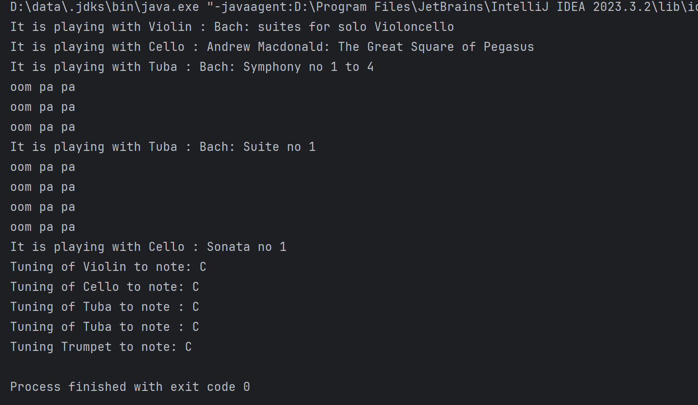

**Author:**
[Guan Wang(002341590)]

**Orchestra Management System**

This Java application provides a simple management system for orchestrating various musical instruments. It offers two implementations: one using standard arrays and another using ArrayLists.

**Features:**

1. **Adding Instruments:** You can add different types of instruments to the orchestra, including Viola, Cello, Tuba, and even anonymous instruments like Trumpet.

2. **Playing Instruments:** The system allows you to play all instruments in the orchestra, producing the corresponding musical sounds.

3. **Tuning Instruments:** You can tune all instruments in the orchestra to a specific note.

**Classes:**

1. **Orchestra:** Manages the instruments either using standard arrays or ArrayLists. It provides functionalities for adding instruments, playing all instruments, tuning all instruments, and iterating through the instruments.

2. **OrchestraArrayList:** The same implementation of the Orchestra class using ArrayList for managing instruments.

3. **Viola, Cello, Tuba:** Classes representing different types of instruments. They implement the instrument interface, providing functionalities for playing and tuning the respective instruments.

4. **Main:** The main class where the orchestra is created, instruments are added, and operations like playing and tuning are performed.

**Usage:**

1. **Adding Instruments:** To add an instrument to the orchestra, create an instance of the instrument class (Viola, Cello, Tuba, etc.) and use the `addInstrument()` method of the Orchestra or OrchestraArrayList class.

2. **Playing Instruments:** Call the `playAll()` method of the Orchestra or OrchestraArrayList class to play all instruments in the orchestra.

3. **Tuning Instruments:** Use the `tuneAll(char note)` method of the Orchestra or OrchestraArrayList class to tune all instruments in the orchestra to the specified note.

**Note:**

- Ensure that the instrument classes implement the instrument interface with the required methods (`play()` and `tune(char note)`).

- You can extend the application by adding more instrument types and functionalities as needed.

}

Code result
